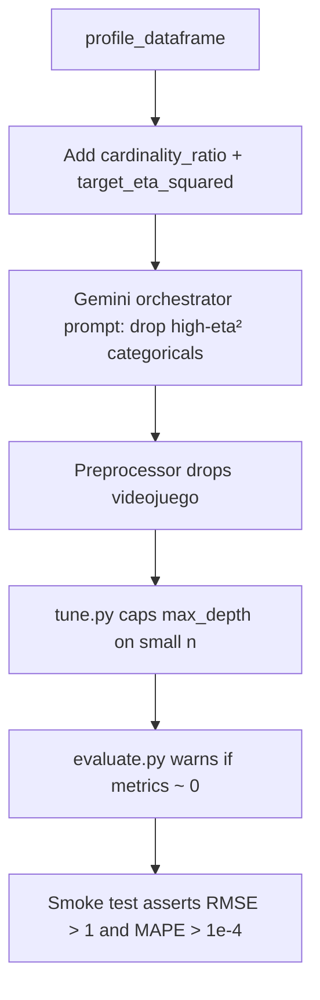

# Fix Plan: Zero Metrics / Perfect Overfitting

## Symptom

Running `python scripts/run_pipeline.py` completes successfully but reports:

```
Metrics: {'mse': 0.0, 'rmse': 0.0, 'mae': 0.0, 'mape': 0.0}
```

This is not a crash — it is **silent perfect overfitting** on the 30% holdout.

## Root cause analysis

### Bug 1 — Gemini keeps `videojuego` (primary cause)

When the orchestrator does **not** drop `videojuego`, the column is one-hot encoded into 8 dummy features. Each game has a narrow budget distribution (within-group std ≈ 217 vs global std ≈ 292). A `DecisionTreeRegressor` with `max_depth=None` memorises game → budget mappings on the 70% train split. The 30% holdout contains rows from the **same games**, so predictions match exactly → all metrics become `0.0`.

**Evidence:**
- With deterministic plan dropping `videojuego`: RMSE ≈ 30.96, MAPE ≈ 6.04%
- With live Gemini plan keeping `videojuego`: RMSE = 0.0, MAPE = 0.0
- `y_pred` on holdout exactly equals `y_test`: `[100.0, 400.0, 50.0, 20.0, 230.0]`

### Bug 2 — Profile lacks leakage signals

[`src/ml_pipeline/profiling.py`](src/ml_pipeline/profiling.py) reports `unique_count` but not:
- `cardinality_ratio` (`unique_count / n_rows`) — `videojuego` is 8/152 ≈ 0.05, which looks like a nominal category, not an ID
- `target_eta_squared` — variance of group means / total variance; high value signals target leakage

Without these, Gemini cannot distinguish a leaky nominal column from a useful predictor.

### Bug 3 — Prompt contradicts itself

[`src/ml_pipeline/orchestrator/prompts.py`](src/ml_pipeline/orchestrator/prompts.py) says:
- "Drop identifier-like columns (e.g. product names, IDs)"
- "Be conservative: when unsure, keep the column"

`videojuego` has only 8 unique values, so it does not look high-cardinality. Gemini follows the conservative rule and keeps it.

### Bug 4 — No post-training sanity check

[`src/ml_pipeline/steps/evaluate.py`](src/ml_pipeline/steps/evaluate.py) returns metrics without warning when all values are suspiciously `0.0`. The pipeline exits as if training succeeded.

### Bug 5 — `max_depth=None` allowed on small datasets

[`src/ml_pipeline/steps/tune.py`](src/ml_pipeline/steps/tune.py) includes `max_depth: [None, 3, 5, 8, 12, 20]` in the search grid regardless of dataset size. On 152 rows with 17 features, `max_depth=None` enables full memorisation.

## Architecture of the fix



## Fixes (in implementation order)

### Fix 1 — Enrich categorical profile with leakage signals

**File:** [`src/ml_pipeline/profiling.py`](src/ml_pipeline/profiling.py)

For each categorical column (when `target` is numeric), add:
- `cardinality_ratio`: `unique_count / n_rows`
- `target_eta_squared`: one-way ANOVA eta-squared = `SS_between / SS_total`

```python
def _eta_squared(series: pd.Series, target: pd.Series) -> float:
  groups = target.groupby(series)
  ss_between = sum(len(g) * (g.mean() - target.mean()) ** 2 for _, g in groups)
  ss_total = ((target - target.mean()) ** 2).sum()
  return float(ss_between / ss_total) if ss_total > 0 else 0.0
```

**Test:** `tests/unit/test_profiling.py::test_profile_categorical_has_cardinality_ratio_and_eta_squared`
- Load `data/videojuegos.csv`
- Assert `videojuego` profile has both fields
- Assert `target_eta_squared > 0.1` (confirms high association)

---

### Fix 2 — Harden orchestrator prompt

**File:** [`src/ml_pipeline/orchestrator/prompts.py`](src/ml_pipeline/orchestrator/prompts.py)

Add explicit rule:
> For categorical columns: if `target_eta_squared > 0.3` AND `cardinality_ratio < 0.2` on datasets with fewer than 1000 rows, treat the column as a high-risk target-leaking predictor. Drop it unless business context confirms it is a genuine causal feature available at prediction time.

Remove or narrow: *"Be conservative: when unsure, keep the column"* — apply only to numeric columns.

**Test:** `tests/unit/test_orchestrator.py::test_orchestrator_drops_high_eta_column_on_videojuegos` (`@pytest.mark.live_gemini`)
- Profile `data/videojuegos.csv` with enriched fields
- Call live Gemini orchestrator
- Assert `"videojuego"` appears in `plan.columns_to_drop`

---

### Fix 3 — Post-training sanity warning

**File:** [`src/ml_pipeline/steps/evaluate.py`](src/ml_pipeline/steps/evaluate.py)

After computing metrics, if all four are below `suspicion_threshold` (default `1e-6`), emit:

```python
warnings.warn(
    "All holdout metrics are ~0.0 — possible perfect overfitting. "
    "Check for identifier/leaky categorical columns not dropped by the orchestrator.",
    RuntimeWarning,
    stacklevel=2,
)
```

**Test:** `tests/unit/test_evaluate.py::test_evaluate_warns_on_perfect_fit`
- Fit tree on `X_train`, evaluate on same `X_train`/`y_train`
- Assert `pytest.warns(RuntimeWarning, match="perfect overfitting")`

---

### Fix 4 — Cap `max_depth=None` on small datasets

**File:** [`src/ml_pipeline/steps/tune.py`](src/ml_pipeline/steps/tune.py)

Before building `RandomizedSearchCV`, if `len(X_train) < 500` and `None` is in `max_depth` grid, remove it. Optionally cap at `min(20, n_features * 2)`.

```python
if len(X_train) < 500 and None in param_grid.get("max_depth", []):
    param_grid["max_depth"] = [v for v in param_grid["max_depth"] if v is not None]
```

**Test:** `tests/unit/test_tune.py::test_tune_caps_max_depth_on_small_dataset`
- Run tune on a 50-row synthetic fixture
- Assert `best_params["max_depth"] is not None`

---

### Fix 5 — Videojuegos smoke regression test

**File:** `tests/integration/test_videojuegos_smoke.py` (new)

End-to-end guard that would have caught this bug:

```python
@pytest.mark.live_gemini
def test_videojuegos_pipeline_metrics_are_non_zero(has_gemini_key, project_root, tmp_path):
    result = TrainingPipeline().run(
        train_path=project_root / "data" / "videojuegos.csv",
        future_path=project_root / "data" / "videojuegos-datosFuturos.csv",
        artifacts_dir=tmp_path,
    )
    assert result.metrics["rmse"] > 1.0, "RMSE ~0 indicates perfect overfitting"
    assert result.metrics["mape"] > 1e-4, "MAPE ~0 indicates perfect overfitting"
```

Also update [`tests/e2e/test_end_to_end.py`](tests/e2e/test_end_to_end.py) with the same metric sanity assertions.

## Expected outcome after fixes

| Scenario | Before | After |
|----------|--------|-------|
| Gemini keeps `videojuego` | RMSE = 0.0 (silent) | Warning emitted; smoke test fails |
| Gemini drops `videojuego` (prompt fix) | N/A | RMSE ≈ 30, MAPE ≈ 6% |
| Small dataset + `max_depth=None` | Full memorisation | Depth capped in search grid |

## Files changed

| File | Change |
|------|--------|
| `src/ml_pipeline/profiling.py` | Add `cardinality_ratio`, `target_eta_squared` |
| `src/ml_pipeline/orchestrator/prompts.py` | High-η² drop rule, remove contradictory guidance |
| `src/ml_pipeline/steps/evaluate.py` | `RuntimeWarning` on near-zero metrics |
| `src/ml_pipeline/steps/tune.py` | Remove `max_depth=None` for small `n` |
| `tests/unit/test_profiling.py` | New eta-squared test |
| `tests/unit/test_orchestrator.py` | New videojuegos drop test |
| `tests/unit/test_evaluate.py` | New perfect-fit warning test |
| `tests/unit/test_tune.py` | New max_depth cap test |
| `tests/integration/test_videojuegos_smoke.py` | New smoke regression test |
| `tests/e2e/test_end_to_end.py` | Add metric sanity assertions |

## Test execution order (TDD)

1. Write failing tests (Fixes 1–5)
2. Implement Fix 1 (profiling) → green profiling test
3. Implement Fix 2 (prompt) → green orchestrator test (live Gemini)
4. Implement Fix 3 (evaluate warning) → green warning test
5. Implement Fix 4 (tune cap) → green tune test
6. Implement Fix 5 (smoke) → green after Fixes 1+2
7. Run full suite: `pytest -v`
