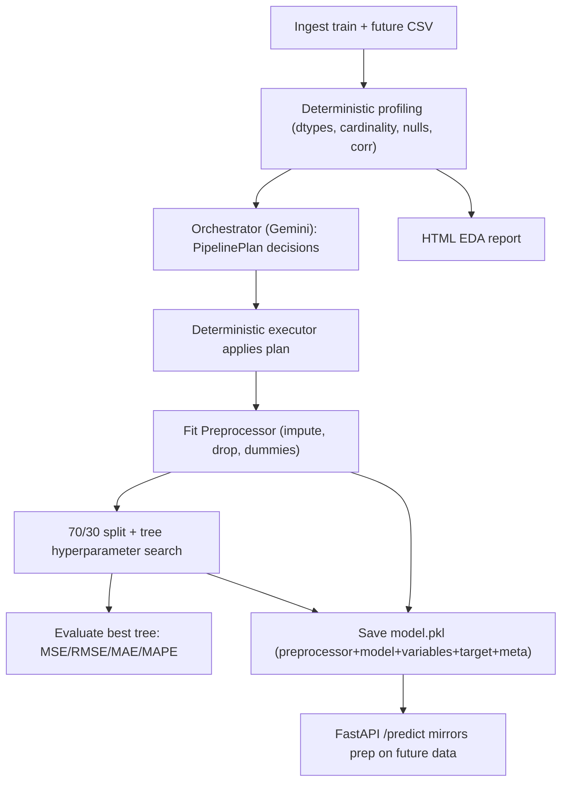

# LangChain Autonomous ML Pipeline (Regression)

## Architecture

The system splits responsibility cleanly:

- **Orchestrator agent (Gemini via LangChain)** decides ONLY the non-deterministic things: which columns to drop (irrelevant/redundant), column-type overrides, imputation strategy per column, and whether/how to handle outliers. It receives a deterministic data *profile* and returns a structured `PipelinePlan`.
- **Deterministic engine** executes every mechanical step (ingest, clean, impute, encode, split, train, evaluate, persist, report, deploy-transform, predict, serve). No AI in these.



### Key generalization rule (no AI needed)
- **Target detection is deterministic**: `target = set(train.columns) - set(future.columns)`; falls back to config/last column if unavailable. The videojuegos target `Presupuesto para invertir` is exactly the column missing from the future CSV.
- A single serializable `Preprocessor` object stores all fitted state (imputation fill-values per column, dropped columns, dummy structure via stored `variables`, optional scaler). Its `.transform(df)` guarantees future data is reconciled to the exact training column set via `reindex(columns=variables, fill_value=0)` — mirroring `Deploy_modelo_videojuegos.ipynb` but robustly.
- Works for numeric-only, categorical-only, and mixed datasets because every step branches on dtype, not on hardcoded column names.

### Tree path (per your choice: native numerics)
- No discretization, no scaling. Categoricals one-hot encoded with `pd.get_dummies`; numerics passed raw to the tree.
- **Deterministic hyperparameter search** (no AI): after 70/30 split, run multiple `DecisionTreeRegressor` fits via `RandomizedSearchCV` on `X_train` only, with a fixed `random_state` and bounded param grid:
  - `max_depth`: `[None, 3, 5, 8, 12, 20]`
  - `min_samples_leaf`: `[1, 2, 4, 8, 16]`
  - `min_samples_split`: `[2, 5, 10, 20]`
  - `criterion`: `["squared_error", "absolute_error"]`
  - `n_iter`: configurable (default `20`), `scoring="neg_root_mean_squared_error"`, `cv=3`
- Select the **local best** parameter set (lowest RMSE on inner CV within `X_train`). `RandomizedSearchCV` refits the winner on the full **70% train split only** (`refit=True` on `X_train`, never on 100%).
- Evaluate that fitted model on the held-out **30%** (`X_test`, `Y_test`) and persist it directly to `model.pkl` — **no refit on 100%** of prepared data.
- Persist `best_params`, `cv_results` summary, and holdout (30%) metrics in `model.pkl` metadata for traceability.

## Orchestrator decision contract

`PipelinePlan` (Pydantic, via `llm.with_structured_output`):
- `columns_to_drop: list[{name, reason}]` (high-cardinality IDs/free-text like `videojuego`, near-constant, redundant via correlation)
- `type_overrides: dict[col -> "numeric"|"categorical"]`
- `imputation: dict[col -> "median"|"mean"|"mode"]` (defaults applied deterministically if LLM omits)
- `outliers: {apply: bool, method: "iqr_clip"|"none"}`
- `model_family: "tree"` (fixed by requirement, recorded for traceability)

Prompt embeds guidelines + the deterministic profile JSON. Temperature 0. The executor validates the plan against the real schema (drops unknown columns, never drops the target) so a bad LLM response can't corrupt the run.

## Repository structure

```
langchain-autonomous-ml-pipeline/
  README.md
  requirements.txt
  pyproject.toml
  .gitignore                # ignores .env, artifacts/, *.pkl, __pycache__
  .env.example              # GOOGLE_API_KEY=, GEMINI_MODEL=gemini-3.5-flash
  config/pipeline_config.yaml
  data/
    videojuegos.csv
    videojuegos-datosFuturos.csv
  src/ml_pipeline/
    __init__.py
    config.py               # dotenv load, settings
    profiling.py            # deterministic dataset profile for the LLM
    orchestrator/
      __init__.py
      schemas.py            # PipelinePlan + decision models
      prompts.py            # guidelines prompt
      agent.py              # ChatGoogleGenerativeAI("gemini-3.5-flash") planner
    preprocessor.py         # fit/transform Preprocessor (serializable)
    steps/
      ingest.py  clean.py  impute.py  feature_select.py
      encode.py  split.py  tune.py  train.py  evaluate.py  persist.py
    report.py               # HTML EDA report (describe + plots + corr heatmap)
    pipeline.py             # TrainingPipeline.run(): plan -> execute -> artifacts
    deployment/
      prepare_future.py     # mirror prep using stored Preprocessor
      api.py                # FastAPI app + /predict, /health
    cli.py                  # python -m ml_pipeline.cli train
  scripts/
    run_pipeline.py
    serve_api.py            # binds any free port, prints URL
  artifacts/                # outputs (gitignored): prepared_dataset.csv, model.pkl, report.html
  tests/
    conftest.py
    fixtures/               # synthetic numeric_only / cat_only / mixed CSVs
    unit/   test_profiling, test_impute, test_feature_select, test_encode,
            test_split, test_tune, test_train, test_evaluate, test_persist,
            test_report, test_orchestrator
    integration/  test_preprocessor_roundtrip, test_prepare_future, test_api
    e2e/   test_end_to_end.py
```

## Outputs (acceptance artifacts)
- `artifacts/prepared_dataset.csv` — final post-prep training dataset (traceability)
- `artifacts/model.pkl` — `{preprocessor, model, variables, target, metrics, best_params, tuning_summary, metadata}`
- `artifacts/report.html` — statistical description + visualizations
- FastAPI service on an auto-selected free port; `POST /predict` returns the full future dataset with a prediction column appended (mirrors the deploy notebook).

## FastAPI service
- `POST /predict` accepts JSON records (or CSV upload), loads `model.pkl`, runs `preprocessor.transform` (reindex to `variables`), predicts, appends `prediccion` column, returns full records as JSON.
- `serve_api.py` finds a free port (socket bind to port 0) and launches uvicorn, printing the URL.

## TDD-style testing (live Gemini, per your choice)
Write tests first for each deterministic unit, then implement to green:
- **Unit**: profiling stats; impute fills numeric=median/cat=mode; feature_select honors plan + protects target; encode produces stable dummy columns; split is 70/30; `tune.py` runs multiple tree iterations on `X_train` and returns a `best_params` dict with lower holdout RMSE than a naive default tree on a synthetic fixture; train saves the best tree fit on 70% only (no 100% refit); evaluate returns all four metrics on the 30% holdout; persist round-trips the bundle including `best_params`; report writes valid HTML with required sections; orchestrator returns a schema-valid `PipelinePlan` from **live Gemini** (asserts structure/validity, not exact wording).
- **Generalizability**: same pipeline asserted on numeric-only, categorical-only, and mixed fixtures.
- **Integration**: `Preprocessor` fit/transform column-count reconciliation; future-data prep matches training `variables`; FastAPI `/predict` via `TestClient`.
- **E2E** (`test_end_to_end.py`): run the full pipeline on `videojuegos.csv` (live Gemini orchestration) -> assert all three artifacts exist and are valid -> bind a real free port, start the API, POST `videojuegos-datosFuturos.csv` rows via `httpx`, assert response row count matches input and every row has a numeric prediction. This verifies the full acceptance criteria.

Tests require `GOOGLE_API_KEY` in `.env` (live calls). README documents this.

## Dependencies
`langchain`, `langchain-google-genai`, `langchain-core`, `pandas`, `numpy`, `scikit-learn`, `matplotlib`, `fastapi`, `uvicorn`, `python-dotenv`, `pydantic`, `pyyaml`, `pytest`, `httpx`.